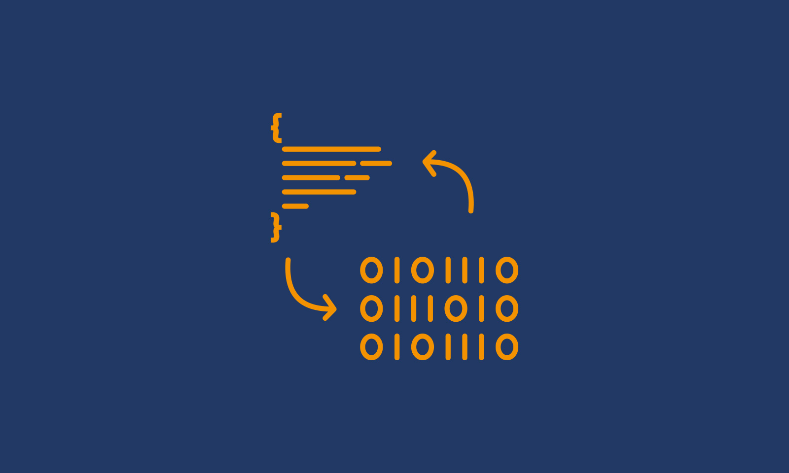

# NLP (Natural Language Processing)

This repository has a series of challenges to learn NLP, part of the IA specialization at the UBA (University of Buenos Aires).

---

## Challenge N°1: Word2vec
This challenge consists in to learn the basic concepts of NLP, we implement by hand the conversion of sentences to vectors using **OneHotEncoding**, after we using **Frequency Vectors**, and finally **TFIDF**.

[Link to Colab](https://github.com/santiago2205/CEIA/blob/master/Natural_Language_Processing/1%20-%20word2vec.ipynb)

## Challenge N°2: Rule based bot using DNN + spaCy
In this challenge, we put into practice the preprocessing in NLP with **tokenization**, **steeming**, and **lemmatization**. To do this, we used the libraries **NLTK** and **SpaCY**.

[Link to Colab](https://github.com/santiago2205/CEIA/blob/master/Natural_Language_Processing/2c%20-%20bot_tfidf_nltk.ipynb)

## Challenge N°3: Custom embeddings using Gensim
In this challenge we **training of custom embeddings** using the library **Gensim** to analyze the lyrics of songs written.

[Link to Colab](https://github.com/santiago2205/CEIA/blob/master/Natural_Language_Processing/3b%20-%20Custom%20embedding%20con%20Gensim)

## Challenge N°4: Word prediction using RNN
In this challenge, we learn the concept of a **Recurrent Neural Network (RNN)**. We implement many_to_one architecture for doing **word prediction**.

[Link to Colab](https://github.com/santiago2205/CEIA/blob/master/Natural_Language_Processing/4d%20-%20predicci%C3%B3n_palabra.ipynb)

## Challenge N°5: Reviews classification using LSTM
In this challenge, we learn the concept of a **Long-Short Term Memory (LSTM)** and the **FastText** library which provide **pretrained embeddings**. We tested it by developing classifier reviews of clothing ecommerce.

[Link to Colab](https://github.com/santiago2205/CEIA/blob/master/Natural_Language_Processing/5d%20-%20clothing_ecommerce_reviews.ipynb)

## Challenge N°6: Q&A bot using Seq2Seq
